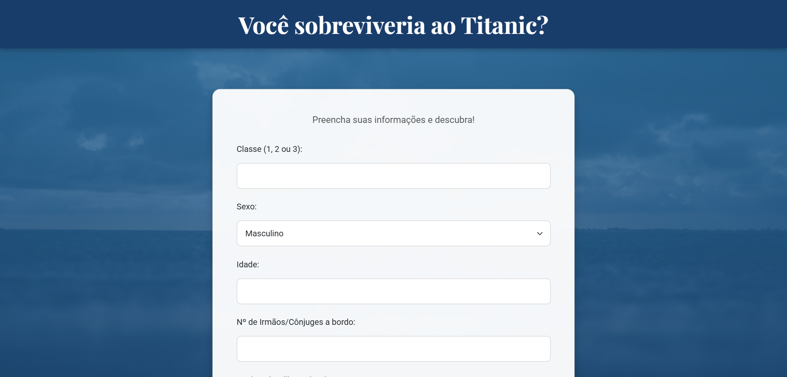

# 🚢 Previsão de Sobrevivência no Titanic

 Uma aplicação web construída com Flask e Scikit-learn que utiliza um modelo de Machine Learning para prever se um passageiro teria sobrevivido ao desastre do Titanic com base em suas características.

**Visite a aplicação online:** [https://SEU-SITE.onrender.com](https://titanic-predictor-09r5.onrender.com)

---

## ✨ Funcionalidades Principais

* **Interface Interativa:** Formulário web simples e responsivo para que o usuário insira seus dados.
* **Previsão em Tempo Real:** O modelo de Machine Learning processa os dados e retorna a previsão de sobrevivência instantaneamente.
* **Análise de Dados Completa:** O projeto inclui um notebook Jupyter (`.ipynb`) com toda a análise exploratória dos dados, limpeza, treinamento e avaliação do modelo.

---

## 🛠️ Tecnologias Utilizadas

Este projeto foi construído utilizando as seguintes tecnologias:

* **Back-end:**
    * 
    * 
* **Front-end:**
    * 
    * 
    * 
* **Ciência de Dados:**
    * 
    * 
    * 
* **Deploy:**
    * 

---

## 🚀 Como Executar o Projeto Localmente

Para rodar este projeto no seu próprio computador, siga os passos abaixo:

1.  **Clone o repositório:**
    ```bash
    git clone [https://github.com/SEU-USUARIO/SEU-REPOSITORIO.git](https://github.com/SEU-USUARIO/SEU-REPOSITORIO.git)
    cd SEU-REPOSITORIO
    ```

2.  **Crie e ative um ambiente virtual:**
    ```bash
    python -m venv venv
    venv\Scripts\activate
    ```

3.  **Instale as dependências:**
    ```bash
    pip install -r requirements.txt
    ```

4.  **Execute a aplicação Flask:**
    ```bash
    flask run
    ```

5.  Abra seu navegador e acesse `http://127.0.0.1:5000`.

---

## 📂 Estrutura do Projeto

/projeto_titanic
|
|-- .gitignore
|-- app.py                    # Lógica do back-end (Flask)
|-- requirements.txt          # Dependências do projeto
|-- titanic_survival_model.pkl  # Modelo de ML treinado
|-- README.md                 # Documentação do projeto
|
|-- /data/
|   |-- train.csv
|
|-- /notebook/
|   |-- AnaliseExploratoriaTitanic.ipynb
|
|-- /static/                  # Arquivos estáticos (CSS, imagens)
|   |-- style.css
|
|-- /templates/               # Arquivos HTML do front-end
|   |-- index.html
